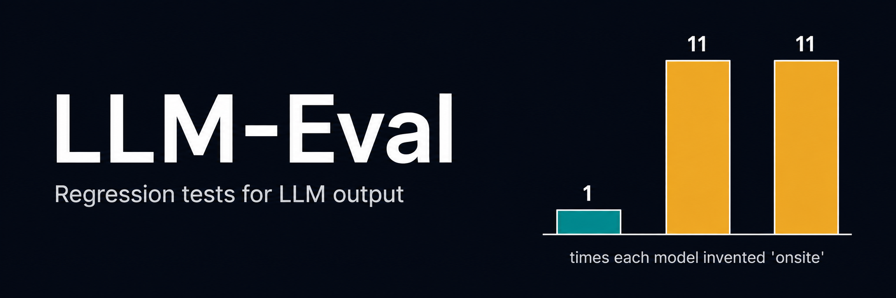
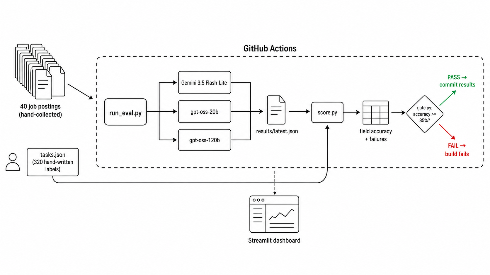

# LLM-Eval

A benchmark that checks how well language models pull structured data out of
job postings, and fails the build when accuracy drops.

**Live dashboard:** https://llm-eval-rekhii.streamlit.app/

## The finding

Job postings often say nothing about whether a role is remote, hybrid, or
onsite. I labelled those cases `unclear`.

Out of 40 postings, `gpt-oss-20b` answered `onsite` 11 times when the posting
said nothing at all. `gpt-oss-120b` did the same. Gemini did it once.

The open models fill silence with a plausible guess. Gemini reports the
silence. Both look identical if you only read the output, which is the point
of having a benchmark.

## What it does

I collected 40 real job postings from Naukri and labelled 8 fields in each one
by hand. That gives 320 correct answers to check against.

Three models get the same prompt and the same posting, and return JSON. A
scorer compares each field against my labels and prints where they disagree. A
gate in GitHub Actions fails the build if accuracy falls below 85%.

Calling and scoring are separate steps. Model output is saved to disk, so I can
change a scoring rule and re-score instantly without spending API calls again.

## How it works



The labels feed into scoring, not into the models. Nothing the models see comes
from my answer key.


## Results

| Field | Gemini 3.5 Flash-Lite | gpt-oss-20b | gpt-oss-120b |
|---|---|---|---|
| title | 100% | 100% | 100% |
| company | 95% | 95% | 95% |
| location | 95% | 95% | 95% |
| years_experience | 95% | 90% | 92% |
| employment_type | 98% | 88% | 95% |
| education_required | 90% | 68% | 78% |
| remote | 85% | 60% | 60% |
| salary_min | 98% | 98% | 98% |
| **Overall** | **94%** | **87%** | **89%** |

| | Gemini | 20b | 120b |
|---|---|---|---|
| Invented "onsite" | 1 | 11 | 11 |
| Invented a salary | 0 | 0 | 0 |
| Broke the schema | 0 | 0 | 0 |
| Unparseable JSON | 0 | 0 | 0 |

Every model returned valid JSON every time, so reliability is not what separates
them. Nearly all the difference sits in two fields: `remote` and
`education_required`.

## One run is not a measurement

I ran the same code on the same data twice. `gpt-oss-120b` invented `onsite` 7
times in one run and 11 in the other. Four postings out of forty changed answer
with no change in input.

So I would not claim 120b is better than 20b at this. On a single run it looked
that way, and it was noise.

## How the ground truth was built

I opened each posting on Naukri, copied it from the job title downwards, and
saved it raw, markdown links and formatting junk included. Cleaning it by hand
would mean doing the model's job for it.

Then I read each one and filled in the fields myself.

**The rule:** use only the structured header at the top of the posting. Do not
infer anything from the description text. If the header does not say, the
answer is `null` or `unclear`.

That rule is what makes the `remote` result meaningful. A model that reads
"we're a fast-paced office culture" in the body and answers `onsite` has
inferred something the posting never stated.

I did not use an LLM to generate the labels. If I had, the benchmark would be
measuring which model agrees most with another model.

## Scoring decisions

**Cities are compared as a set, with aliases.** Bangalore and Bengaluru are the
same place, so a model naming either is correct. Same for Bombay/Mumbai and
Gurgaon/Gurugram. Order does not matter.

**Text fields use exact match after lowercasing.** This is strict. `gpt-oss-20b`
returned "GenAI / ML Engineer" where the header said "GenAI / ML Engineer-Sri",
and that counts as wrong. Fuzzy matching would need a similarity threshold, and
I would have no principled reason to pick one number over another.

**Unpaid is 0, Not Disclosed is null.** An unpaid internship states its salary.
A posting that says nothing does not. Treating those the same would hide a real
difference.

**Salaries are in lakhs**, matching how Naukri displays them, which avoids
conversion mistakes on my side.

**Out-of-schema values are counted separately** from wrong answers. `remote` has
four allowed values; returning `null` is a different kind of failure from
returning the wrong one.

## What the models got wrong

**Both `Nesco` and `Bangalore` came from the description body.** On one posting
all three models added a city that was not in the header. It appeared further
down in the job description. This is the same failure as the `onsite` guessing,
just more visible.

**Smaller models ignore instructions more.** `gpt-oss-20b` returned prose like
"Bachelor's degree in Computer Science, Data Science, Engineering, Information
Technology, or a related field" where the header field said "Any Graduate". The
120b model did this less often. Scale bought instruction-following, not
judgement.

**One label I got wrong.** All three models said the company on posting 15 was
"Careerminds" and I had written "Talent". When every model disagrees with you,
check your own work first.

## The bug that made this worth building

My first full run scored 59%. All three models were wrong on the same postings,
in the same way, which does not happen if three independent models are just
making mistakes.

The postings and my labels were offset. Label 17 described the posting in file
19. I had skipped a file while pasting and everything after it shifted.

I found it because the models agreed with each other and disagreed with me.
That is exactly what an eval harness is for, and I would not have noticed by
reading outputs.

## Running it

```bash
pip install -r requirements.txt
```

Put your keys in a `.env` file:

```
GEMINI_API_KEY=...
GROQ_API_KEY=...
```

Both are free tiers with no credit card. Then:

```bash
python -m src.run_eval    # calls all 3 models, writes results/latest.json
python -m src.score       # prints the table and every disagreement
python -m src.gate        # exits 1 if accuracy is below 85%
streamlit run app.py      # dashboard
```

The eval takes about 8 minutes, mostly waiting between calls to stay inside
Gemini's rate limit.

## In CI

`.github/workflows/eval.yml` runs the whole thing on every push to `src/` or
`data/`, then commits the results back to the repo. That gives me a history of
every run for free.

The gate has been tested in both directions. I raised the threshold to 99%,
confirmed it exits with code 1, then set it back to 85%. A gate that has only
ever passed has not been tested.

Two things I added after CI broke:

Groq rate-limited about 15 of the 120 calls on the runner, which never happened
locally because I type slower than a CI machine. The retry has escalating
backoff on 429, so all 120 still completed.

The first CI run had no API keys and every call failed. The scorer happily
reported 10.6%, because `null` matched my labels on the fields that are
genuinely null. It now stops with an error if every call fails, rather than
producing a number that looks like a result.

## Limitations

**40 postings is small.** One posting is 2.5% of the score, so small
differences between models are not meaningful. The `remote` gap is large
enough to trust; the 2 point gap between 20b and 120b overall is not.

**One source, one country, one role family.** All Naukri, all Indian, all ML
and data roles. The `remote` finding may not hold on postings written
differently elsewhere.

**Exact matching is harsh.** A dropped suffix or a reworded degree requirement
counts the same as a wrong answer. A fuzzy variant would score everyone higher.
I chose exact because anyone can rerun it and get my number.

**One labeller, no second opinion.** My labels are the ground truth and nobody
checked them. A second person labelling the same postings would give an
agreement rate, which is what a serious benchmark reports.

**Single run per model.** Given the variance above, three runs and a range
would be the honest version. That is the next thing I would add.

**`salary_min` barely tests anything.** Indian postings mostly say "Not
Disclosed", so this field is null in 32 of 40. It caught zero hallucinations,
which is a real result but a thin one.